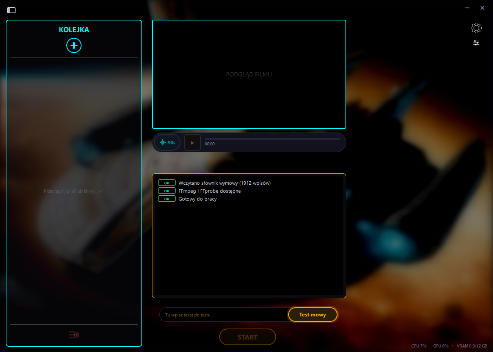

**Dołącz do mojego Serwera:**

# Lektor AI

  

## 🤖 O projekcie
To mój autorski program, który oferuje zaawansowany system Lektora AI wykorzystujący sieci neuronowe do syntezy mowy z napisów filmowych. Program automatycznie generuje naturalnie brzmiący głos lektora w języku polskim i łączy go z oryginalnym wideo w formacie .mkv, tworząc finalny plik z idealną synchronizacją. Program ma też wbudowany tester głosu, który można wykorzystać do wklejania dowolnego tekstu aby zamienić go na mowę.

## 📸 Interfejs programu
Poniżej znajduje się zrzut ekranu przedstawiający działanie aplikacji:

  

## 🚀 Funkcje
* **Głosy neuronowe**: Najwyższa jakość syntezy mowy (Microsoft Edge-TTS oraz OPEN AI-TTS).
* **Miksowanie MKV**: Automatyczne łączenie ścieżek bez utraty jakości wideo.
* **Inteligentna synchronizacja**: Lektor idealnie dopasowany do znaczników czasowych napisów.

## 📱 Wersja mobilna (wkrótce)
Wersja **Lektor AI na Androida** jest już w trakcie opracowywania! Aplikacja mobilna przenosi wszystkie kluczowe funkcje programu na urządzenia z systemem Android — generowanie głosu lektora, obsługa napisów oraz synchronizacja audio — bezpośrednio na Twoim smartfonie lub tablecie.

> **Śledź projekt**, aby nie przegapić premiery wersji mobilnej.

---
*Aby pobrać gotowy program, przejdź do sekcji **Releases** po prawej stronie.*

## 🙏 Podziękowania

Ten projekt opiera się na fantastycznej pracy społeczności open-source. Ogromne podziękowania dla twórców i opiekunów poniższych narzędzi, bez których stworzenie tej aplikacji nie byłoby możliwe:

* **[CustomTkinter](https://github.com/TomSchimansky/CustomTkinter)** (Tom Schimansky) – za dostarczenie wspaniałego, nowoczesnego frameworka do budowania estetycznych interfejsów graficznych (GUI) w Pythonie.
* **[edge-tts](https://github.com/rany2/edge-tts)** (rany2) – za genialny wrapper umożliwiający bezproblemową integrację z wysokiej jakości chmurowym systemem syntezy mowy (Text-to-Speech) bezpośrednio w kodzie.
* **[pysrt](https://github.com/byroot/pysrt)** – za niezawodną bibliotekę do parsowania i manipulacji plikami z napisami, stanowiącą fundament dla odpowiedniej synchronizacji tekstu.
* **Google GenAI API** – za potężne narzędzia do analizy i przetwarzania języka naturalnego, wspierające logikę tekstową aplikacji.
* **[Pygame](https://www.pygame.org/)** – za niezawodny silnik audio (mixer), który świetnie sprawdza się do obsługi i odtwarzania wygenerowanych ścieżek dźwiękowych.
* **[Pillow (PIL)](https://python-pillow.org/)** – za sprawne zarządzanie zasobami graficznymi interfejsu.
* **użytkownikowi [Slawaspr0](https://github.com/Slawaspr0/)** i projektowi LektorAI-by-Slawaspr0 za inspirację do wdrożenia kilku elementów interfejsu,
* **projektowi [Chatterbox](https://github.com/resemble-ai/chatterbox/)** | **[F5-TTS](https://github.com/SWivid/F5-TTS)** za silniki TTS do klonowania i generowania głosu lokalnie,
