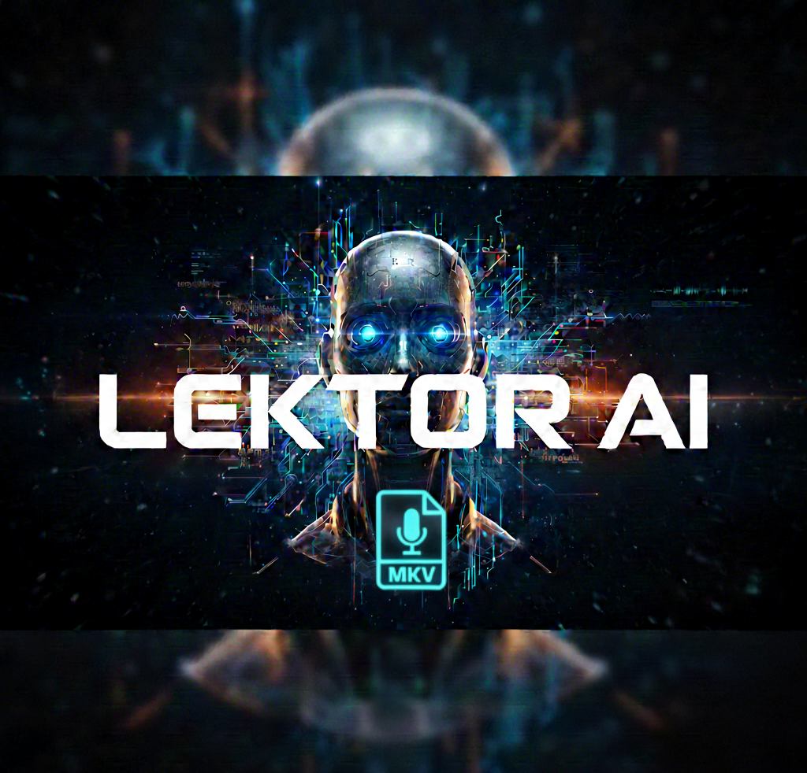
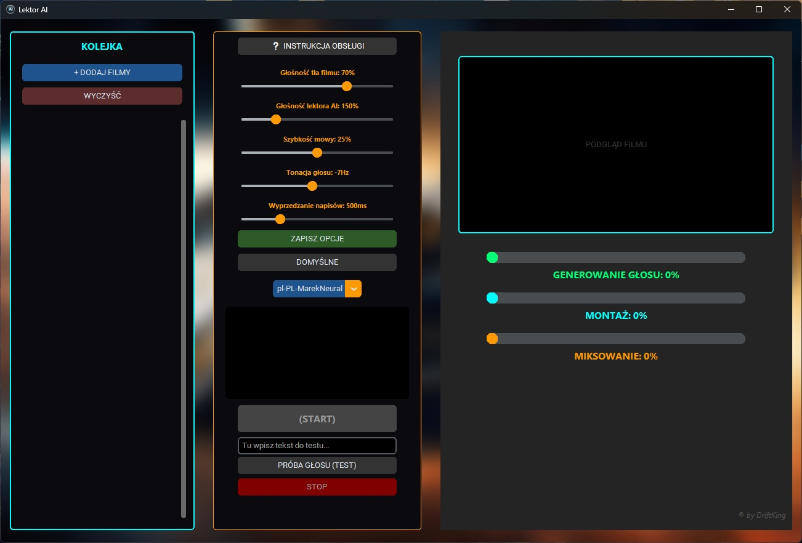

# Lektor AI

  

## 🤖 O projekcie
To mój autorski program, który oferuje zaawansowany system Lektora AI wykorzystujący sieci neuronowe do syntezy mowy z napisów filmowych. Program automatycznie generuje naturalnie brzmiący głos lektora i łączy go z oryginalnym wideo w formacie .mkv, tworząc finalny plik z idealną synchronizacją.

## 📸 Interfejs programu
Poniżej znajduje się zrzut ekranu przedstawiający działanie aplikacji:

  

## 🚀 Funkcje
* **Głosy neuronowe**: Najwyższa jakość syntezy mowy (Microsoft Edge TTS).
* **Miksowanie MKV**: Automatyczne łączenie ścieżek bez utraty jakości wideo.
* **Inteligentna synchronizacja**: Lektor idealnie dopasowany do znaczników czasowych napisów.

---
*Aby pobrać gotowy program, przejdź do sekcji **Releases** po prawej stronie.*
